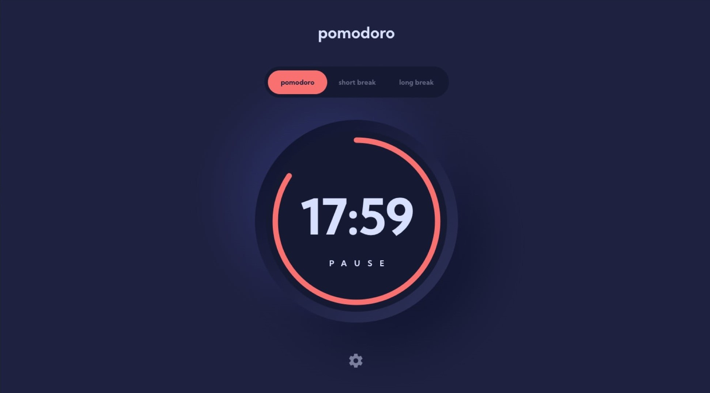

# Pomodoro productivity app

This app helps practice the pomodoro workflow, which composes of 25minutes of focus time and a short 5minute break & 15minute break after 4th iteration.

## Table of contents

- [Overview](#overview)
  - [The challenge](#the-challenge)
  - [Screenshot](#screenshot)
- [My process](#my-process)
  - [Built with](#built-with)
  - [What I learned](#what-i-learned)
  - [Continued development](#continued-development)
- [Author](#author)

## Overview

### The challenge

Users should be able to:

- Set a pomodoro timer and short & long break timers
- Customize how long each timer runs for
- See a circular progress bar that updates every minute and represents how far through their timer they are
- Customize the appearance of the app with the ability to set preferences for colors and fonts

### Screenshot



## My process

### Built with

- VueJS
- Vuex
- SCSS Pre-processor
- Mobile-first workflow
- Semantic HTML5 markup
- Flexbox

### What I learned

During this project I empheised practicing with VUEX state management in order to not have repeating code & unecessary component communication. 

I really liked this simple CSS solution to creating a checkmark, simply by using a div, giving it a border bottom & right and rotating it 45° degrees. 
```css
.colors-container {
  ....

  button {
    .....
  }
  .check {
    display: inline-block;
    transform: rotate(45deg);
    height: 14px;
    width: 7px;
    border-bottom: 5px solid black;
    border-right: 5px solid black;
  }
}
```
This VUEX Getter is rather simple and it was very helpful in eliminating a lot of repeated code.
```js
    GET_POM_TIMER(state) {
      if (state.activePomodoro === "pomodoro") {
        return state.pom;
      } else if (state.activePomodoro === "short") {
        return state.short;
      } else if (state.activePomodoro === "long") {
        return state.long;
      }
      return "";
    },
```

### Continued development

I really like this simple app because the pomodoro technique is actually something I like to practice so despite it being one of the more simple applications I built, it turned out to be one of the more useful ones.
For continued development I think it would be nice to orient this app to a market place for other people to use. 

## Author

- Website - [Pierpaolo Pascarella](http://www.pierpaolo-portfolio.xyz/)
